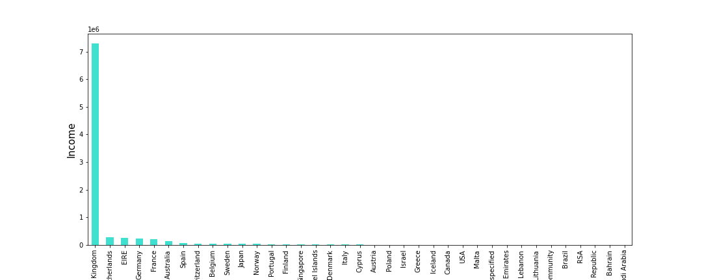
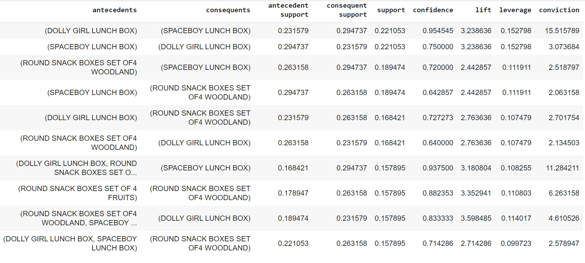
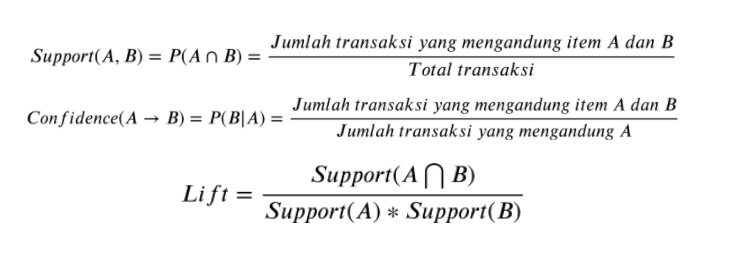

# Online-Retail

## About Data
Data merupakan data transaksi sebuah perusahaan retail di Inggris pada tahun 2010-2011. Data dapat diakses dari situs https://archive.ics.uci.edu/ dengan judul Online Retail yang bersumber dari Dr Daqing Chen.    

## Problem
Pada kali ini, kita akan membahas tentang Market Basket Analysis menggunakan Apriori Algorithm dan Association Rules.
Tujuannya ialah untuk membuat rules yang dapat memprediksi "apakah pembeli akan membeli produk B ketika ia membeli produk A?" sehingga perusahaan dapat menciptakan suatu bundle yang diperkirakan mampu meningkatkan penjualan produk.    
Bahasa yang digunakan adalah Python

## Preprocessing Data
Preprocessing yang dilakukan :
<ul>
  <li>Membuang data null pada kolom CustomerID </li>
  <li>Mengambil data yang tidak dicancel, jika dicancel terdapat huruf "C" pada InvoiceNo </li>
  <li>Mengambil data yang memiliki nilai UK pada kolom Country, diberi tanda UK pada nama variablenya</li>
  <li>Mengambil data yang memiliki nilai Netherlands pada kolom Country, diberi tanda N pada nama variablenya</li>
  <li>Mengambil data yang memiliki nilai EIRE pada kolom Country, diberi tanda E pada nama variablenya</li>
</ul>

 Sehingga data yang digunakan ada 3, yaitu data UK, Netherlands dan EIRE yang masing-masing sudah dilakukan pembersihan data. Namun, yang akan dibahas adalah data dari Netherlands. 

## Exploratory Data

    

 Berdasarkan grafik, diperoleh 3 hal : 

 <ul>
  <li>UK menduduki posisi pertama yang menghasilkan pendapatan terbesar. Hal ini mungkin disebabkan karena retail terletak di UK</li>
  <li>Netherlands menduduki posisi kedua yang menghasilkan pendapatan terbesar.</li>
  <li>EIRE menduduki posisi ketiga yang menghasilkan pendapatan terbesar.</li>
</ul>
 
 

    
 

 Berdasarkan grafik, diperoleh : 

<ul>
  <li>Terdapat penurunan pendapatan yang signifikan pada bulan Maret dan Juni 2011</li>
</ul>

 Pada bulan Maret, hal ini mungkin disebabkan karena adanya demonstrasi yang cukup besar terjadi pada tanggal 26 Maret. Namun hal ini perlu ditelusuri lebih lanjut guna dapat mengurangi risiko kerugian.     

 Selanjutnya, dilakukan analisis pada item / produk yang dijual untuk menjawab "Produk apakah yang paling diminati oleh masyrakat Netherlands ? " 

 

    
 

 Berdasarkan grafik, Spaceboy Lunch Box merupakan produk yang lebih diminati oleh masyarakat Netherlands dalam periode 2010 - 2011 

## Model Basket

 Sekarang akan masuk ke bagian model basket, model ini menggunakan <i>Support, Confidence </i> dan <i> Lift </i> sebagai penentu produk yang akan dijadikan bundle.   Output yang diperoleh adalah sebagai berikut 

    

  <ul>
    <li> Support yang tinggi menandakan bahwa produk antecedents dan consequent sangat populer, </li>
    <li> confidence yang tinggi menandakan bahwa adanya hubungan asosiasi yang kuat antara produk antecedents dengan consequent, </li> 
    <li> Lift ratio mengukur seberapa penting rule yang telah terbentuk berdasarkan nilai support dan confidence. Lift ratio merupakan nilai yang menunjukkan kevalidan proses transaksi dan memberikan informasi apakah benar produk dibeli bersamaan dengan produk lainnya. </li> 
  </ul>
Transaksi dikatakan valid jika nilai lift bernilai lebih dari 1. Secara umum, berikut rumusan matematis untuk menghitung nilai-nilai tersebut. 

    

## Rekomendasi
Pada negara Netherlands, dolly girl lunch box, spaceboy lunch box, dan round snack boxes set of 4 woodland dapat dijadikan suatu paketan (bundle). 

Selain itu, dapat juga untuk item-item yang memiliki rules lift tinggi untuk diletakan berdekatan.

## Referensi
<ul>
  <li> https://en.wikipedia.org/wiki/Association_rule_learning </li>
  <li> Rahmawati, Nadya dan Nasution, Yuki N. 2017 "Aplikasi Data Mining Market Basket Analysis untuk Menemukan Pola Pembelian di Toko Metro Utama Balikpapan". Jurnal EKSPONENSIAL Volume 8, Nomor 1, Mei 2017. Hal 1-7. </li>
</ul>

## Info
Notebook berisikan salah satu metode yang dipakai dalam suatu lomba Data Science di Indonesia oleh tim yang beranggotakan :
- Gabrielle Christy
- Rheco Paradhika K.
- Yusuf Firdaus A.  
